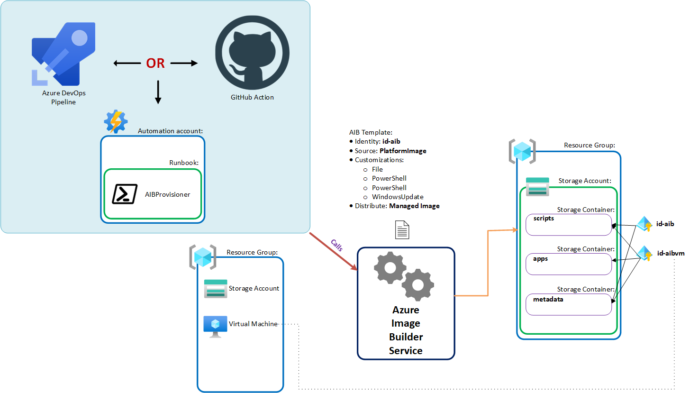

<!-- prettier-ignore -->
<div align="center">

# Azure Image Builder for Dev Box

[](https://learn.microsoft.com/azure/azure-resource-manager/bicep/overview)
[](https://github.com/PowerShell/PowerShell)
[](LICENSE)

[Overview](#overview) • [Prerequisites](#prerequisites) • [Getting Started](#getting-started) • [Deployment](#deployment) • [Debugging](#debugging)

</div>

An end-to-end solution for creating and managing custom VM images for [Microsoft Dev Box](https://learn.microsoft.com/azure/dev-box/overview-what-is-microsoft-dev-box) using [Azure Image Builder](https://learn.microsoft.com/azure/virtual-machines/image-builder-overview) and Bicep. Deploy with a single command — or automate via CI/CD — to produce golden images stored in an Azure Compute Gallery.

## Overview



The solution provisions an Azure Image Builder template that:

1. **Downloads artifacts** from a storage account using a managed identity
2. **Runs customization scripts** (`Entrypoint.ps1`) to install software, apply settings, etc.
3. **Cleans up** (`Exitpoint.ps1`) and deprovisions the VM via Sysprep
4. **Distributes** the resulting image to an Azure Compute Gallery, with optional multi-region replication

Two Bicep modules handle image template creation:

| Module | Use case |
|---|---|
| `aib.module.bicep` | Public networking — no VNet integration |
| `aib.module-private.bicep` | Private networking — build VM retrieves scripts via private endpoint |

## Features

- **Infrastructure as Code** — fully declarative Bicep templates with parameterized configuration
- **Three networking modes** — public, bring-your-own VNet, or fully provisioned VNet (NSGs, NAT gateways, Bastion, private endpoints)
- **Multiple deployment options** — Azure DevOps Pipelines, GitHub Actions, Azure Automation, or manual PowerShell
- **Smart redeployment** — detects code changes to avoid unnecessary template redeployments
- **Key Vault integration** — optionally pass secrets to customization scripts at build time
- **Image replication** — distribute images to multiple Azure regions
- **Staging resource group** — isolate build-time resources with automatic cleanup

## Prerequisites

### Azure subscription

<details open>
<summary><strong>Resource providers</strong></summary>

Register the following resource providers on your subscription:

- `Microsoft.VirtualMachineImages`
- `Microsoft.ContainerInstance`

**Azure CLI:**

```bash
az provider register --namespace Microsoft.VirtualMachineImages
az provider register --namespace Microsoft.ContainerInstance
```

**Azure PowerShell:**

```powershell
Register-AzResourceProvider -ProviderNamespace Microsoft.VirtualMachineImages
Register-AzResourceProvider -ProviderNamespace Microsoft.ContainerInstance
```

</details>

<details open>
<summary><strong>RBAC and permissions</strong></summary>

| Requirement | Details |
|---|---|
| **Image distribution** | The AIB identity needs [permissions to distribute images](https://learn.microsoft.com/azure/virtual-machines/linux/image-builder-permissions-powershell#allow-vm-image-builder-to-distribute-images) on the Compute Gallery |
| **Managed Identity Operator** | The AIB identity needs [Managed Identity Operator](https://learn.microsoft.com/azure/role-based-access-control/built-in-roles/identity#managed-identity-operator) (or `Microsoft.ManagedIdentity/userAssignedIdentities/assign/action`) on the build VM's user-assigned identity. See the [documentation](https://learn.microsoft.com/azure/virtual-machines/linux/image-builder-json?tabs=json%2Cazure-powershell#user-assigned-identity-for-the-image-builder-build-vm) |
| **Staging resource group** | If using a staging resource group, the **Owner** role must be assigned to the AIB identity |

</details>

<details>
<summary><strong>VNet integration (optional)</strong></summary>

When providing your own subnet, ensure:

1. The AIB managed identity has these [VNet permissions](https://learn.microsoft.com/azure/virtual-machines/linux/image-builder-permissions-powershell#permission-to-customize-images-on-your-virtual-networks):
   - `Microsoft.Network/virtualNetworks/read`
   - `Microsoft.Network/virtualNetworks/subnets/join/action`

2. The Private Link Service network policy is disabled on the subnet. See the [documentation](https://learn.microsoft.com/azure/private-link/disable-private-link-service-network-policy?tabs=private-link-network-policy-powershell):

   **Azure CLI:**

   ```bash
   az network vnet subnet update \
     --name <subnet_name> \
     --vnet-name <vnet_name> \
     --resource-group <resource_group> \
     --disable-private-link-service-network-policies true
   ```

   **Azure PowerShell:**

   ```powershell
   $subnet = '<subnet_name>'
   $net = @{
       Name = '<vnet_name>'
       ResourceGroupName = '<resource_group>'
   }
   $vnet = Get-AzVirtualNetwork @net
   ($vnet | Select -ExpandProperty subnets | Where-Object {$_.Name -eq $subnet}).privateLinkServiceNetworkPolicies = "Disabled"
   $vnet | Set-AzVirtualNetwork
   ```

</details>

### Tools

- [Azure CLI](https://learn.microsoft.com/cli/azure/install-azure-cli) (with Bicep extension) **or** [Azure PowerShell](https://learn.microsoft.com/powershell/azure/install-azure-powershell) (`Az.Accounts`, `Az.Storage`, `Az.ImageBuilder`)
- [Bicep CLI](https://github.com/Azure/bicep/releases) (included with Azure CLI, or install standalone)

## Getting started

### Networking modes

The `IaC/ProvisionAll/aib.bicep` template supports three networking modes, automatically inferred from the `subnetId` and `virtualNetworkName` parameters:

| Mode | `subnetId` | `virtualNetworkName` | Behavior |
|---|---|---|---|
| **Public** | _(empty)_ | _(empty)_ | No VNet. Uses the public storage module |
| **Bring-your-own VNet** | provided | _(ignored)_ | Your subnet IDs are passed to the private storage module. Networking module is **not** deployed |
| **Provision VNet** | _(empty)_ | provided | Full networking stack is deployed: VNet, subnets, NAT gateways, NSGs, Bastion, and storage private endpoint |

> [!NOTE]
> When `subnetId` is provided, `virtualNetworkName` is ignored — bring-your-own VNet always takes precedence.

The `bastionSkuName` parameter controls the Azure Bastion SKU (`Basic`, `Standard`, or `Developer`). When set to `Developer`, the NSG rule on `VMBuilderSubnet` automatically adds `168.63.129.16/32` as a source, since Developer SKU Bastion connects from the Azure platform IP instead of the Bastion subnet.

> [!WARNING]
> The **Developer** SKU is a free-tier offering intended for dev/test scenarios only. It does **not** provide an SLA, does not require a public IP or dedicated `AzureBastionSubnet`, and **must not be used in production**. See the [Azure Bastion SKU comparison](https://learn.microsoft.com/azure/bastion/configuration-settings#skus) for details.

### Choosing a source image

Dev Box requires compatible images. List available base images:

**Azure CLI:**

```bash
az devcenter admin image list --dev-center-name <dev_center_name> --resource-group <resource_group> --query "[].name"
```

**Azure PowerShell:**

```powershell
Get-AzDevCenterAdminImage -DevCenterName <dev_center_name> -ResourceGroupName <resource_group> | Select-Object -ExpandProperty Name
```

Translate a Dev Box image name to an [ImageTemplateSource](https://learn.microsoft.com/azure/templates/microsoft.virtualmachineimages/imagetemplates?pivots=deployment-language-bicep#imagetemplatesource-objects) object. For example, `microsoftwindowsdesktop_windows-ent-cpc_win11-24h2-ent-cpc` becomes:

```json
{
  "type": "PlatformImage",
  "publisher": "MicrosoftWindowsDesktop",
  "offer": "windows-ent-cpc",
  "sku": "win11-24h2-ent-cpc",
  "version": "latest"
}
```

> [!TIP]
> Use the `HelperScripts/Get-AzImageInfo.ps1` script for an interactive picker that outputs the correct JSON.

### Customization scripts

Place your customization logic in `Scripts/Entrypoint.ps1` (runs during image build) and `Scripts/Exitpoint.ps1` (cleanup before Sysprep). Both scripts receive `-SubscriptionId` and optionally `-KeyVaultName` / `-KeyVaultSecretName` parameters.

See the `Scripts/Examples/` folder for ready-to-use examples, including Dev Box post-setup tasks.

> [!TIP]
> Add the `sha256Checksum` property to customizers in `aib.module.bicep` to ensure script integrity:
> ```powershell
> (Get-FileHash -Path .\Scripts\DownloadArtifacts.ps1 -Algorithm Sha256).Hash
> ```

## Deployment

### Azure DevOps

Use the pipeline definition in `Deployment/azure-pipeline.yaml`. It automatically detects whether template redeployment is needed before deploying and running the image build.

### GitHub Actions

Use the workflow in `Deployment/github-action.yaml`. Configure the following secrets and variables in your repository:

| Type | Name |
|---|---|
| Secret | `AZURE_TENANT_ID`, `AZURE_CLIENT_ID`, `AZURE_SUBSCRIPTION_ID` |
| Variable | `RESOURCE_GROUP_NAME`, `LOCATION` |

### Azure Automation

Use `Deployment/AzureAutomation-Runbook.ps1` as a runbook. It downloads the Bicep templates from a storage account, compiles and deploys them, then runs the image template — all using managed identity.

### Manual

<details>
<summary><strong>Bring your own resources</strong></summary>

**Azure CLI:**

```bash
az deployment group create \
  --resource-group <resource_group> \
  --template-file ./IaC/BringYourOwnResources/aib.bicep \
  --parameters <path/to/aib-parameters.jsonc> \
  --verbose
```

**Azure PowerShell:**

```powershell
New-AzResourceGroupDeployment `
  -ResourceGroupName <resource_group> `
  -TemplateFile ./IaC/BringYourOwnResources/aib.bicep `
  -TemplateParameterFile <path/to/aib-parameters.jsonc> `
  -Verbose
```

</details>

<details>
<summary><strong>Full (provision all resources)</strong></summary>

**Azure CLI:**

```bash
az deployment sub create \
  --location <location> \
  --name <deployment_name> \
  --template-file ./IaC/ProvisionAll/aib.bicep \
  --parameters <path/to/aib.parameters.json> \
  --verbose
```

**Azure PowerShell:**

```powershell
New-AzDeployment `
  -Location <location> `
  -Name <deployment_name> `
  -TemplateFile ./IaC/ProvisionAll/aib.bicep `
  -TemplateParameterFile <path/to/aib.parameters.json> `
  -Verbose
```

</details>

After deploying the template, trigger the image build with `Deployment/Invoke-ImageTemplate.ps1`:

```powershell
./Deployment/Invoke-ImageTemplate.ps1 `
  -ResourceGroupName <resource_group> `
  -ImageTemplateName <image_template_name> `
  -OutputLogs
```

## Debugging

Build logs are stored in the staging resource group's storage account under the `packerlogs` blob container. Download the log file to review the full build process.

> [!TIP]
> [CMTrace](https://www.microsoft.com/en-us/evalcenter/download-microsoft-endpoint-configuration-manager) (found under `SMSSETUP\Tools` after extraction) provides a more readable log viewing experience.

### Debug VM

For deeper troubleshooting, you can deploy a standalone Windows VM into the same `VMBuilderSubnet` used by Image Builder. This lets you RDP into the network (via Bastion) and manually test scripts, verify connectivity to the storage account, or inspect private endpoints.

Deploy using the `IaC/DebugVM/main.bicep` template:

> [!NOTE]
> The admin password must be 12–123 characters long and meet 3 of 4 complexity requirements: lowercase, uppercase, digit, and special character.
>
> Quick generate with PowerShell:
> ```powershell
> # Exclude ambiguous or problematic symbols by adding them to the filter
> $exclude = [char[]]'`"''{}[]|'
> $chars = (33..126 | ForEach-Object { [char]$_ }) | Where-Object { $_ -notin $exclude }
> $pwd = -join ($chars | Get-Random -Count 16); Write-Host $pwd
> ```

**Azure CLI:**

```bash
az deployment group create \
  --resource-group <resource_group> \
  --template-file ./IaC/DebugVM/main.bicep \
  --parameters ./IaC/DebugVM/main.parameters.jsonc \
  --parameters adminPassword=<admin_password> \
  --verbose
```

**Azure PowerShell:**

```powershell
New-AzResourceGroupDeployment `
  -ResourceGroupName <resource_group> `
  -TemplateFile ./IaC/DebugVM/main.bicep `
  -TemplateParameterFile ./IaC/DebugVM/main.parameters.jsonc `
  -adminPassword (Read-Host -AsSecureString 'Admin Password') `
  -Verbose
```

## Important notes

> [!IMPORTANT]
> If you modify files referenced in the image template customizers, you must **delete and recreate** the template. Azure Image Builder copies those files to the staging resource group at provisioning time and does not detect changes. Applies only in public mode.

> [!WARNING]
> Azure Image Builder does not support service endpoints or private endpoints by design. When using private networking, the build VM retrieves scripts through a private endpoint managed by the `aib.module-private.bicep` module, **not** through the built-in File customizer.

> [!WARNING]
> When `prepopulateStorageWithExampleScripts` is set to `true`, the storage account's **public network access remains enabled** so the deployment script can upload example files. Additionally, the `deploymentScripts` resource provisions a **temporary storage account** (managed by the platform) with `allowSharedKeyAccess` enabled, because Azure Container Instances (ACI) can only mount file shares via an access key. If you set `prepopulateStorageWithExampleScripts` to `false` and use private networking (`subnetId` or `virtualNetworkName`), public network access is automatically **disabled** and the storage account is only accessible via private endpoints.

## Project structure

```
IaC/
├── aib.module.bicep              # Image template (public networking)
├── aib.module-private.bicep      # Image template (private networking)
├── BringYourOwnResources/        # Deploy into existing infra
├── ProvisionAll/                 # Deploy everything from scratch
│   ├── aib.bicep                 # Main orchestrator
│   ├── networking.bicep          # VNet, NSGs, NAT, Bastion, PE
│   ├── associatedresources.module.bicep
│   ├── stagingresources.module.bicep
│   └── shared.bicep
└── DebugVM/                      # Standalone VM for debugging
Scripts/
├── Entrypoint.ps1                # Build-time customizations
├── Exitpoint.ps1                 # Cleanup before Sysprep
├── DownloadArtifacts.ps1         # Managed-identity artifact download
├── DeprovisioningScript.ps1      # Sysprep generalization
└── Examples/                     # Sample customization scripts
Deployment/
├── azure-pipeline.yaml           # Azure DevOps pipeline
├── github-action.yaml            # GitHub Actions workflow
├── AzureAutomation-Runbook.ps1   # Azure Automation runbook
├── Invoke-ImageTemplate.ps1      # Run the image template
└── Get-CodeChanges.ps1           # Detect changes for redeployment
HelperScripts/
├── Get-AzImageInfo.ps1           # Interactive image source picker
└── HelperFunctions.ps1           # Shared utilities
```

## Resources

- [Azure Image Builder documentation](https://learn.microsoft.com/azure/virtual-machines/image-builder-overview)
- [Image Builder Bicep reference](https://learn.microsoft.com/azure/templates/microsoft.virtualmachineimages/imagetemplates?pivots=deployment-language-bicep)
- [Azure Image Builder permissions](https://learn.microsoft.com/azure/virtual-machines/linux/image-builder-permissions-powershell)
- [Microsoft Dev Box documentation](https://learn.microsoft.com/azure/dev-box/overview-what-is-microsoft-dev-box)
- [Azure Verified Modules (AVM)](https://aka.ms/avm)