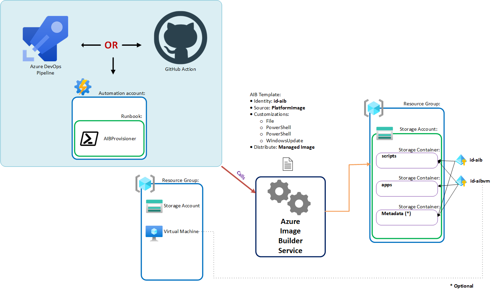

# Azure Image Builder solution for creating custom VM images for Dev Box

## Architecture



## Prerequisites

- You need to have the resources provider `Microsoft.VirtualMachineImages` and `Microsoft.ContainerInstance` on the subscription enabled
- [Bicep](https://github.com/Azure/bicep/releases) to deploy the resources
- If you are providing a subnet:
  - please make sure the user managed identity of the image builder has the following [permissions](https://learn.microsoft.com/en-us/azure/virtual-machines/linux/image-builder-permissions-powershell#permission-to-customize-images-on-your-virtual-networks) for the vnet:
     - Microsoft.Network/virtualNetworks/read
     - Microsoft.Network/virtualNetworks/subnets/join/action
  - Disable the Private Service Policy on the subnet. See the [documentation](https://learn.microsoft.com/en-us/azure/private-link/disable-private-link-service-network-policy?tabs=private-link-network-policy-powershell) for more information.
    ```powershell
    $subnet = 'default'

    $net = @{
        Name = 'myVnet'
        ResourceGroupName = 'myResourceGroup'
    }
    $vnet = Get-AzVirtualNetwork @net

    ($vnet | Select -ExpandProperty subnets | Where-Object {$_.Name -eq $subnet}).privateLinkServiceNetworkPolicies = "Disabled"

    $vnet | Set-AzVirtualNetwork
    ```
- The proper [permissions](https://learn.microsoft.com/en-us/azure/virtual-machines/linux/image-builder-permissions-powershell#allow-vm-image-builder-to-distribute-images) to distribute images on the compute gallery (formally known as Shared Image Gallery (SIG))
- [Managed Identity Operator](https://learn.microsoft.com/en-us/azure/role-based-access-control/built-in-roles/identity#managed-identity-operator) (or RBAC permission `Microsoft.ManagedIdentity/userAssignedIdentities/assign/action`) on the Build VM User Managed Identity assigned to the Azure Image Builder identity to be able to associate it to the build VM. See the [documentation](https://learn.microsoft.com/en-us/azure/virtual-machines/linux/image-builder-json?tabs=json%2Cazure-powershell#user-assigned-identity-for-the-image-builder-build-vm) for more information.
- If you are using the Staging resource group, the Owner RBAC role needs to be assigned to the Azure Image Builder identity.

## Determining the images

Dev Box requires images. For ease of use, you can start with the base images that are available within dev box.<br/>
To list available images in Dev Box, use the following command:

```shell
az devcenter admin image list --dev-center-name name --resource-group rgname --query "[].name"
```

The output should be something like the following:

```json
[
  "microsoftwindowsdesktop_windows-ent-cpc_win11-22h2-ent-cpc-os",
  "microsoftwindowsdesktop_windows-ent-cpc_win11-22h2-ent-cpc-m365",
  "microsoftwindowsdesktop_windows-ent-cpc_win10-22h2-ent-cpc-m365",
  "microsoftvisualstudio_visualstudio2019plustools_vs-2019-ent-general-win11-m365-gen2",
  "microsoftvisualstudio_visualstudio2019plustools_vs-2019-pro-general-win11-m365-gen2",
  "microsoftvisualstudio_visualstudioplustools_vs-2022-ent-general-win11-m365-gen2",
  "microsoftvisualstudio_visualstudioplustools_vs-2022-pro-general-win11-m365-gen2",
  "microsoftvisualstudio_visualstudio2019plustools_vs-2019-ent-general-win10-m365-gen2",
  "microsoftvisualstudio_visualstudio2019plustools_vs-2019-pro-general-win10-m365-gen2",
  "microsoftvisualstudio_visualstudioplustools_vs-2022-ent-general-win10-m365-gen2",
  "microsoftvisualstudio_visualstudioplustools_vs-2022-pro-general-win10-m365-gen2",
  "microsoftvisualstudio_windowsplustools_base-win11-gen2",
  "microsoftwindowsdesktop_windows-ent-cpc_win11-23h2-ent-cpc-m365",
  "microsoftwindowsdesktop_windows-ent-cpc_win11-23h2-ent-cpc",
  "microsoftwindowsdesktop_windows-ent-cpc_win11-22h2-ent-cpc",
  "microsoftwindowsdesktop_windows-ent-cpc_win10-22h2-ent-cpc",
  "microsoftwindowsdesktop_windows-ent-cpc_win11-24h2-ent-cpc-m365",
  "microsoftwindowsdesktop_windows-ent-cpc_win11-24h2-ent-cpc"
]
```

To use the Image Builder, you do need to translate this to the equivalent "ARM" object, that is an [ImageTemplateSource](https://learn.microsoft.com/en-us/azure/templates/microsoft.virtualmachineimages/imagetemplates?pivots=deployment-language-bicep#imagetemplatesource-objects). You can use the `HelperScripts/Get-AzImageInfo.ps1` PowerShell script to help you with this.<br/>

### Example:
For instance, if you would want to convert the Dev Box image `microsoftwindowsdesktop_windows-ent-cpc_win11-24h2-ent-cpc`, the ImageSourceTemplate equivalent would be:

```json
{
  "sku": "win11-24h2-ent-cpc",
  "publisher": "MicrosoftWindowsDesktop",
  "version": "latest",
  "offer": "windows-ent-cpc"
}
```

## Customizers tweaks

You may want to add the `sha256Checksum` property to the customizers in `aib.module.bicep` to make sure that your scripts aren't tempered with. To get the hash, you can use the following PowerShell CmdLet:

```powershell
(Get-FileHash -Path .\Scripts\DownloadArtifacts.ps1 -Algorithm Sha256).Hash
```

## Deployment

You can deploy this solution using 3 ways:
- Azure DevOps, using the `azure-pipeline.yaml` file
- GitHub Actions, using the `github-action.yaml`
- Azure Automation Account, using the `AzureAutomation-Runbook.ps1` file
- Manually using the following the following PowerShell commandlet:

Bring your own resources:
```PowerShell
New-AzResourceGroupDeployment -ResourceGroupName <your_resource_group> -TemplateParameterFile /path/to/aib-parameters.jsonc -TemplateFile /path/to/IaC/BringYourOwnResources/aib.bicep -Verbose
```

Full:
```PowerShell
New-AzDeployment -Location CanadaCentral -Name <your_resource_group> -TemplateParameterFile /path/to/aib.parameters.json -TemplateFile /path/to/IaC/ProvisionAll\aib.bicep -Verbose
```
## Debugging

The logs are located in the storage account in the staging resource group, under the blob container `packerlogs`. you can download the log file to view the process. While not exactly meant for this, you can also use a tool like [CMTrace](https://www.microsoft.com/en-us/evalcenter/download-microsoft-endpoint-configuration-manager) to view the log in an easier fashion. Just run executable and it will unzip itself. Once you see the files within you simply go to `SMSSETUP\Tools` and you will find the tool there.

## Notes

If you make a change to the files that are specified in the customizers section of the template, you will need to delete the template and recreate it. This is because Azure Image Builder creates a copy of those files in the staging resource group.

## Customization examples

See the Scripts/Examples folder